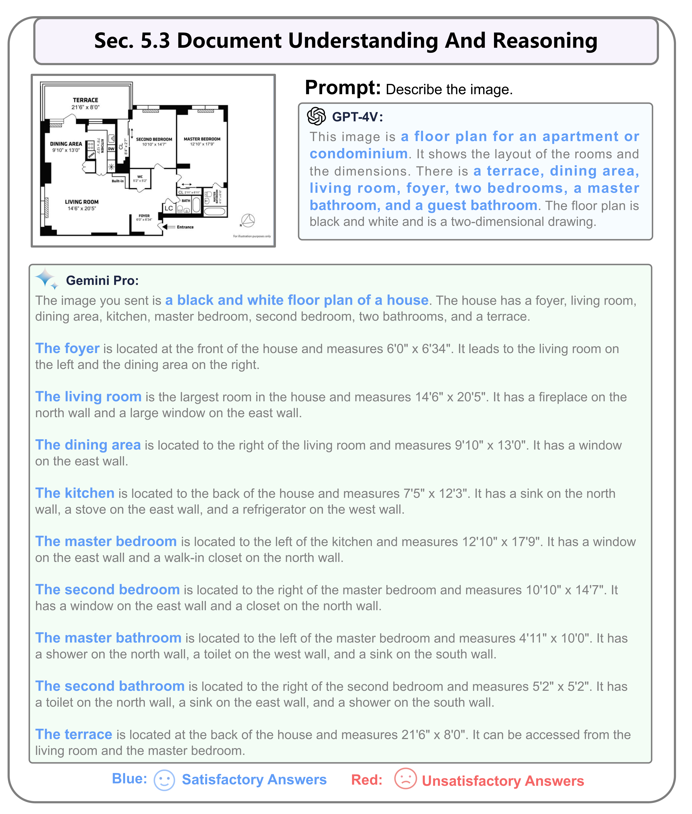

# Gemini  vs : A Preliminary Comparison and Combination of Vision-Language Models Through Qualitative Cases


<p align="center">
  	<a href="https://img.shields.io/badge/version-v0.1.0-blue">
      
    </a>
  <a >
       
  	</a>
  <a >
       
  	</a>
    <br />
</p>

##  Overview

This paper presents an in-depth **qualitative** comparative study of two pioneering models: Google's **Gemini** and OpenAI's **GPT-4V(ision)**. Our study involves a multi-faceted evaluation of both models across key dimensions such as Vision-Language Capability, Interaction with Humans, Temporal Understanding, and assessments in both Intelligence and Emotional Quotients.


##  News

🔥 2023/12/26:  We have released the [Arxiv Paper](https://cdn.openai.com/contributions/gpt-4v.pdf) (115 pages), all results are shown in it.


##  Gemini's Input Modes
Our goal is to clarify the input modality of Gemini. GPT-4V's input modality supports the continuous ingestion of multiple images as context, thereby possessing enhanced memory capabilities. However, for Gemini, its unique attributes are manifested in several aspects, as follows: 

- $\color{darkred}{Single\ Image\ Input.}$ Gemini is **limited to inputting a single image at a time**. Additionally, it cannot process independent images; instead, it requires accompanying textual instructions.
- $\color{darkred}{Limited\ Memory\ Capacity.}$ Unlike GPT-4V, Gemini's multimodal module **lacks the ability to retain the memory of past image inputs and outputs**. Therefore, when dealing with multiple images, our approach requires combining all the images into a single image input. This integrated input mode will be used unless explicitly stated otherwise.
- $\color{darkred}{Sensitive\ Information\ Masking.}$ Gemini exhibits some degree of obfuscation when processing images **containing explicit facial or medical information**, making it unable to recognize these images. This may impose certain limitations on its generalization ability.
- $\color{darkred}{Image\ and\ Link\ Output.}$ Unlike GPT-4V, which is limited to generating textual outputs, Gemini has the ability to **create images related to the content and provide corresponding links**. This establishes a higher level of association similar to search engine functionality.
- $\color{darkred}{Video\ Input\ and\ Comprehension.}$ Gemini demonstrates the capability to **understand videos and requires a YouTube link as a video input**. It's important to note that it **can effectively process videos accompanied by accurate subtitle files**. However, its comprehension ability may be limited when dealing with single, simple, and information-scarce videos.


##  Demos
Here we present several examples to illustrate and compare; for more cases (50 cases), please refer to [Demo Examples](./demos/demo_ENG.md). For Chinese version, please refer to [中文解读](./demos/demo_CHN.md).

For all results (108 cases), please refer the [arxiv paper](https://cdn.openai.com/contributions/gpt-4v.pdf).


### 2.2 Landmark_Recognition


### 3.3 Chart Text Recognition


### 5.3 Document Understanding And Reasoning



##  Contents

### Comparison in 5 aspects：
${Section\ 2 \to\ 6 }$ divide the multimodal evaluation into five aspects. The first level involves basic recognition of images and the text within them. The second level goes beyond recognition to require further inference and reasoning. The third level encompasses multimodal comprehension and inference involving multiple images. 

- $\color{darkorange}{Section\ 2: Image\ Recognition\ and\ Understanding.}$ it addresses the fundamental recognition and comprehension of image content without involving further inference, including tasks such as **identifying landmarks, foods, logos, abstract images, autonomous driving scenes, misinformation detection, spotting differences, and object counting**.
- $\color{darkorange}{Section\ 3: Text\ Recognition\ and\ Understanding\ in\ Images.}$ It concentrates on text recognition (including OCR) within images, such as **scene text, mathematical formulas, and chart \& table text recognition**. Similarly, no further inference of text content is performed here.
- $\color{darkorange}{Section\ 4: Image\ Inference\ Abilities.}$  Beyond basic image recognition, this section involves more advanced reasoning. This includes **understanding humor and scientific concepts, as well as logical reasoning abilities like detective work, image combinations, look for patterns in intelligence tests (IQ Tests), and emotional understanding and expression (EQ Tests)**.
- $\color{darkorange}{Section\ 5: Textual\ Inference\ in\ Images.}$  Building on the text recognition, it involves further reasoning beyond text recognition, including **mathematical problem-solving, chart \& table information reasoning, and document comprehension like paper, report and Graphic Design**.
- $\color{darkorange}{Section\ 6: Integrated\ Image\ and\ Text\ Understanding.}$ It evaluates the collective understanding and reasoning abilities involving both image and text. For instance, tasks include **settling items from a supermarket shopping cart, as well as guiding and modifying image generation**.


### 3 specialized tasks：
${Section\ 7 \to\ 9 }$ evaluate performance in three specialized tasks, namely, object localization, temporal understanding, and multilingual comprehension.

- $\color{darkorange}{Section\ 7: Object\ Localization.}$ It highlights object localization capabilities, tasking the models with providing relative coordinates for specified objects. This includes a focus on outdoor objects like cars in parking lots and abstract image localization.
- $\color{darkorange}{Section\ 8: Temporal\ Video\ Understanding.}$ It evaluates the models' comprehension of temporality using key frames. This section includes two tasks: one involving the understanding of video sequences and the other focusing on sorting key frames.
- $\color{darkorange}{Section\ 9: Multilingual\ Capabilities.}$ It thoroughly assesses capabilities in recognizing, understanding, and producing content in multiple languages. This includes the ability to recognize non-English content within images and express information in other languages.

### Industry (Application)：
${Section\ 10 }$ presents various application scenarios for multimodal large models. We aim to showcase more possibilities to the industry, providing innovative ideas. There is potential to customize multimodal large models for unique domains. Here, we demonstrate seven sub-domains:

- $\color{darkorange}{Section\ 10.1: Industry: Defect\ Detection.}$ This task involves the detection of defects in products on industrial assembly lines, including textiles, metal components, pharmaceuticals, and more.
- $\color{darkorange}{Section\ 10.2: Industry: Grocery\ Checkout.}$ This refers to an autonomous checkout system in supermarkets, aimed at identifying all items in a shopping cart for billing. The goal is to achieve comprehensive recognition of all items within the shopping cart.
- $\color{darkorange}{Section\ 10.3: Industry: Auto\ Insurance.}$ This task involves evaluating the extent of damage in car accidents and providing approximate repair costs, as well as offering repair recommendations.
- $\color{darkorange}{Section\ 10.4: Industry: Customized\ Captioner.}$ The aim is to identify the relative positions of various objects within a scene, with object names provided as conditions and prompts in advance.
- $\color{darkorange}{Section\ 10.5: Industry: Evaluation\ Image\ Generation.}$ This involves assessing the alignment between generated images and given text prompts, evaluating the quality of the generation model.
- $\color{darkorange}{Section\ 10.6: Industry: Embodied\ Agent.}$ This application involves deploying the model in embodied intelligence and smart home systems, offering thoughts and decisions for indoor scenarios.
- $\color{darkorange}{Section\ 10.7: Industry: GUI\ Navigation.}$ This task focuses on guiding users through PC/Mobile GUI interfaces, assisting with information reception, online searches, and shopping tasks.


##  Image/Data Source
All our data is sourced from [The Dawn of LMMs: Preliminary Explorations with GPT-4V(ision)](https://arxiv.org/abs/2309.17421) (except for the images in Section 11, which are sourced from the internet). Here we provide all images in the **imagez_source** folder.

```text
Gemini-vs-GPT4V
├── logo
├── demos
├── image_source
│ ├── 2_Image_Recognition_and_Understanding (main section)
│ │ ├── 2.1_Basic_object_Recognition (subsection)
│ │ │ ├── 2.1_1.png
│ │ ├── 2.2_Landmark_Recognition
│ │ │ ├── 2.2_1.png
│ │ │ ├── 2.2_2.png
│ │ ├── ...
│ │ ├── 2.9_Spot_the_Differences
│ ├── 3_Image_Reasoning_Abilities
│ ├── ...
│ ├── 11_Intergrated_Use
```


##  Conclusions
We have conducted a comprehensive comparison of GPT-4V and Gemini's multimodal understanding and reasoning abilities across multiple aspects and have reached the following conclusions:

- $\color{darkgreen}{Image\ Recognition\ and\ Understanding.}$ In basic image recognition tasks, both models show comparable performance and are capable of completing the tasks effectively.
- $\color{darkgreen}{Text\ Recognition\ and\ Understanding\ in\ Images.}$ Both models excel in extracting and recognizing text from images. However, improvements are needed in complex formulas and dashboard recognition. Gemini performs better in reading table information.
- $\color{darkgreen}{Image\ Inference\ Abilities.}$ In image reasoning, both models excel in common-sense understanding. Gemini slightly lags in look-for-pattern compared (IQ Tests) to GPT-4V. In EQ tests, both understand emotions and have aesthetic judgment.
- $\color{darkgreen}{Textual\ Inference\ in\ Images.}$ In the field of text reasoning, Gemini shows relatively lower performance levels when dealing with complex table-based reasoning and mathematical problem-solving tasks. Furthermore, Gemini tends to offer more detailed outputs.
- $\color{darkgreen}{Integrated\ Image\ and\ Text\ Understanding.}$ In tasks involving complex text and images, Gemini falls behind GPT-4V due to its inability to input multiple images at once, although it performs similarly to GPT-4V in textual reasoning with single images.
- $\color{darkgreen}{Object\ Localization.}$ Both models perform similarly in real-world object localization, with Gemini being slightly less adept at abstract image (tangram) localization.
- $\color{darkgreen}{Temporal\ Video\ Understanding.}$ In understanding temporality, Gemini's single-image input mode falls short compared to GPT-4V, especially in the comprehension of sequence.
- $\color{darkgreen}{Multilingual\ Capabilities.}$ Both models exhibit good multilingual recognition, understanding, and output capabilities, effectively completing multilingual tasks.


In industrial applications, Gemini is outperformed by GPT-4V in **Embodied Agent** and **GUI Navigation**, which is also attributed to Gemini's single-image, non-memory input mode. Combining two large models can leverage their respective strengths. Overall, ***both Gemini and GPT-4V are powerful and impressive multimodal large models***. In terms of overall performance, GPT-4V is slightly stronger than Gemini Pro. This aligns with the results reported by Gemini. We look forward to the release of Gemini Ultra and GPT-4.5, which are expected to bring more possibilities to the field of visual multimodal applications.

## 🔗 Citation

If you find our work helpful, please cite:

```bibtex
@misc{qi2023gemini,
      title={Gemini vs GPT-4V: A Preliminary Comparison and Combination of Vision-Language Models Through Qualitative Cases}, 
      author={Zhangyang Qi and Ye Fang and Mengchen Zhang and Zeyi Sun and Tong Wu and Ziwei Liu and Dahua Lin and Jiaqi Wang and Hengshuang Zhao},
      year={2023},
      eprint={2312.15011},
      archivePrefix={arXiv},
      primaryClass={cs.CV}
}

```

## 📄 License
<a rel="license" href="http://creativecommons.org/licenses/by-nc-sa/4.0/"></a>
<br />
This work is under the <a rel="license" href="http://creativecommons.org/licenses/by-nc-sa/4.0/">Creative Commons Attribution-NonCommercial-ShareAlike 4.0 International License</a>.
