# Gemini vs GPT-4V: A Preliminary Comparison and Combination of Vision-Language Models Through Qualitative Cases
Gemini与GPT-4V：视觉-语言模型的初步比较和结合使用（定性案例研究）


## 🏠 概括
这篇论文提供了对谷歌的Gemini和OpenAI的GPT-4V(ision)两个SOTA模型的深入定性比较研究。我们的研究涉及到对这两个模型在视觉语言能力、与人类的互动、时间理解以及智力和情感智商等关键维度上的多方面评估。完整的例子和论文请见[Arxiv Paper](https://arxiv.org/abs/2312.15011) (115 pages)。


## 🔍 Gemini的独特输入模式
我们的目标是澄清Gemini的输入模式。GPT-4V的输入模式支持连续摄入多个图像作为上下文，因此具有增强的记忆能力。然而，对于Gemini，它的独特属性体现在以下几个方面：

- $\color{darkred}{单图像输入。}$ Gemini一次只能输入一张图像。此外，它无法处理独立的图像；相反，它需要附带的文本说明。
- $\color{darkred}{有限的记忆容量。}$ 与GPT-4V不同，Gemini的多模块缺乏保留过去图像输入和输出记忆的能力。因此，在处理多个图像时，我们的方法需要将所有图像合并为单一图像输入。除非另有明示说明，否则将使用这种综合输入模式。
- $\color{darkred}{敏感信息屏蔽。}$ 当处理包含明确的面部或医疗信息的图像时，Gemini在一定程度上表现出模糊处理，无法识别这些图像。这可能对其泛化能力造成一定限制。
- $\color{darkred}{图像和链接输出。}$ 与仅能生成文本输出的GPT-4V不同，Gemini具有创建与内容相关的图像并提供相应链接的能力。这建立了一种类似于搜索引擎功能的更高级的关联。
- $\color{darkred}{视频输入和理解。}$ Gemini展示了理解视频的能力，需要YouTube链接作为视频输入。需要注意的是，它可以有效处理附带准确字幕文件的视频。然而，在处理单一、简单和信息稀缺的视频时，其理解能力可能受到限制。


## 📋 Contents

### 五个方面的比较：
${第2节到第6节}$ 将多模态评估分为五个方面。第一级涉及对图像及其中文本的基本识别。第二级超越了识别，需要进一步的推理和推断。第三级包括多模态理解和涉及多个图像的推理。

$\color{darkorange}{第2节：图像识别与理解。}$ 它涉及对图像内容的基本识别和理解，不涉及进一步的推理，包括识别地标、食物、标志、抽象图像、自动驾驶场景、虚假信息检测、发现差异和物体计数等任务。
$\color{darkorange}{第3节：图像中的文本识别与理解。}$ 它集中在图像中的文本识别（包括OCR），如场景文本、数学公式和图表及表格文本识别等。同样，在这里不进行文本内容的进一步推断。
$\color{darkorange}{第4节：图像推理能力。}$ 超越基本图像识别，这一部分涉及更高级的推理。这包括理解幽默和科学概念，以及像侦探工作、图像组合、智力测试中寻找模式以及情感理解和表达等逻辑推理能力。
$\color{darkorange}{第5节：图像中的文本推理。}$ 在文本识别的基础上，它涉及超越文本识别的进一步推理，包括数学问题解决、图表信息推理以及纸张、报告和图形设计等文档理解。
$\color{darkorange}{第6节：图像和文本的综合理解。}$ 它评估涉及图像和文本的集体理解和推理能力。例如，任务包括从超市购物车中挑选物品，以及指导和修改图像生成等。

### 三项专业任务：
${第7节到第9节}$ 评估了三项专业任务的性能，即对象定位、时间理解和多语言理解。

$\color{darkorange}{第7节：物体定位。}$ 强调对象定位能力，要求模型提供指定对象的相对坐标。这包括关注室外物体，如停车场中的汽车和抽象图像定位。
$\color{darkorange}{第8节：时间视频理解。}$ 通过关键帧评估模型对时间性的理解。这一部分包括两项任务：一项涉及对视频序列的理解，另一项关注关键帧的排序。
$\color{darkorange}{第9节：多语言能力。}$ 它全面评估在识别、理解和生成多种语言内容方面的能力。这包括在图像中识别非英语内容和以其他语言表达信息的能力。

### 行业应用：
${第10节}$ 展示了多模态大型模型的各种应用场景。我们旨在向行业展示更多可能性，提供创新的思路。可以根据特定领域的需求定制多模态大型模型。在这里，我们展示了七个子领域：

$\color{darkorange}{第10.1节：应用：缺陷检测。}$ 这项任务涉及检测工业装配线上产品的缺陷，包括纺织品、金属零件、药品等。
$\color{darkorange}{第10.2节：应用：杂货结账。}$ 这指的是超市的自动结账系统，旨在识别购物车中的所有物品以进行结账。目标是全面识别购物车内的所有物品。
$\color{darkorange}{第10.3节：应用：汽车保险。}$ 这项任务涉及评估车祸中的损坏程度，并提供大致的维修成本，以及提供维修建议。
$\color{darkorange}{第10.4节：应用：定制字幕生成器。}$ 目标是在场景中识别各种对象的相对位置，提前提供对象名称作为条件和提示。
$\color{darkorange}{第10.5节：应用：评估图像生成。}$ 这涉及评估生成图像与给定文本提示之间的一致性，评估生成模型的质量。
$\color{darkorange}{第10.6节：应用：具身智能代理。}$ 这个应用涉及将模型部署在具体智能和智能家居系统中，为室内情景提供思考和决策。
$\color{darkorange}{第10.7节：应用：GUI导航。}$ 这项任务侧重于指导用户浏览PC/Mobile GUI界面，协助信息接收、在线搜索和购物任务。


## 🤖 Demos
### 第2节：图像识别与理解
对图像内容的基本识别和理解，不涉及进一步的推理，包括识别地标、食物、标志、抽象图像、自动驾驶场景、虚假信息检测、发现差异和物体计数等任务。属于第一层最为基本的任务。一共有9个小节。

### 2.1 基本物体的识别
这里是测试模型基础的物体识别和描述能力。GPT-4V和Gemini都能够准确识别基本物体并根据需要提供文本描述，并无显著差异。
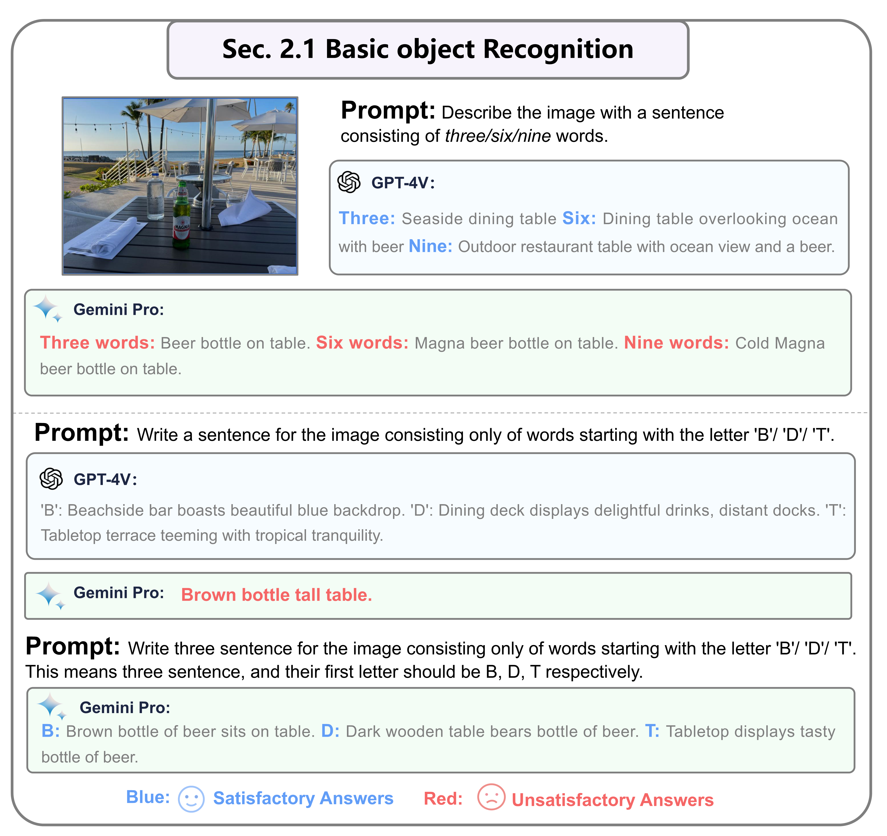

### 2.2 风景名胜识别
虽然这两个模型都擅长准确识别地标，但GPT-4V生成简洁的描述，而Gemini在旅游景点甚至室内倾向于提供更详细的叙述。甚至给出相应的景点其他图片和相关资料链接。


### 2.3 食品识别
这两个模型都展现出识别广泛种类的菜肴的能力，扩展了它们对菜肴图像中细节如配料、装饰和烹饪技巧的识别能力。结论基本和风景名胜一样。


### 2.4 Logo识别
这两个模型都成功识别了标志并提供了全面的描述，捕捉了设计、颜色、形状和符号表示等各个方面的信息。
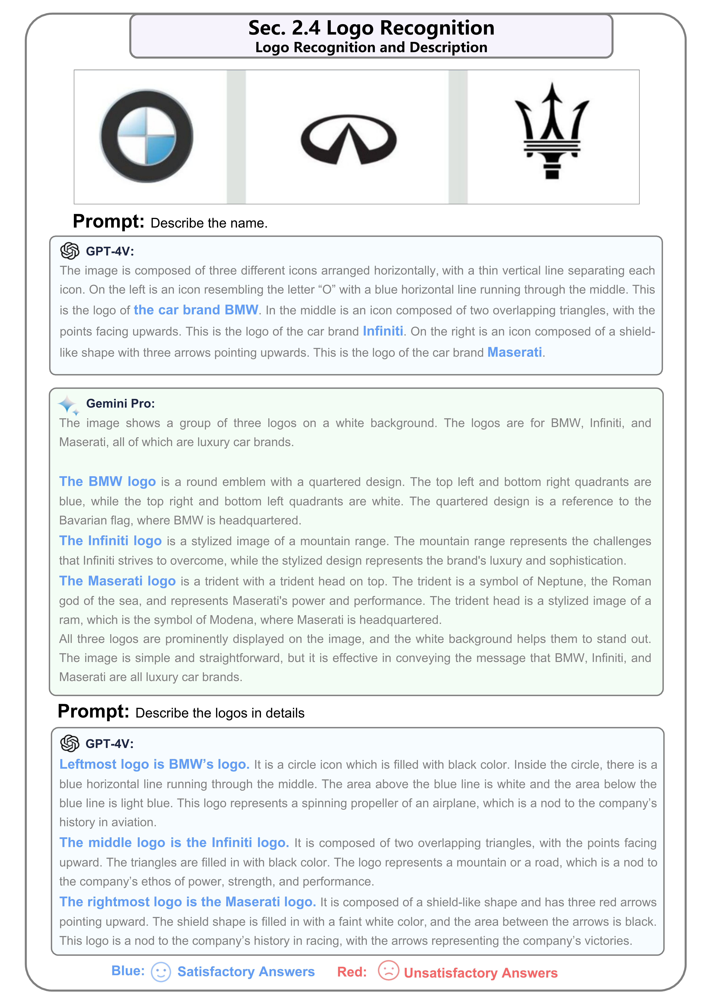

### 2.5 抽象图片识别
尽管GPT-4V提供了合理的回答，但Gemini提供的回答似乎不太符合逻辑。在识别七巧板这种抽象图片中，Gemini的能力相对欠缺。可能是由于是所有图拼接输入的结果。
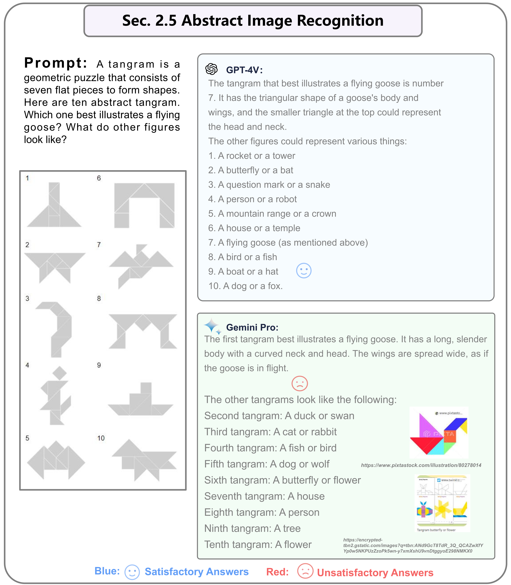

### 2.6 室外场景理解（自动驾驶）
这两个模型都擅长提供场景自动驾驶和物体的详细描述。在第一个例子中，Gemini的描述展示了一个小错误。


### 2.7 反事实示例（捏造物体）
这个意思是给定一张图片。文字prompt中让模型在图片中寻找不存在的物体。我们发现这两个模型都能够提供与图像中所呈现的场景和物体相关的事实性描述。


### 2.8 物体计数能力
任务是统计图片中水果的数量。两个模型在计数方面都有待提高。与GPT-4V相比，Gemini的计数能力相对较弱。由于Gemini的多模态记忆性能相对较弱，它无法被引导到正确的答案。


### 2.9 找不同的能力
这里是两张图片找不同的能力。GPT-4V和Gemini在找不同方面都有一定的局限。GPT-4V找不同的能力更强一些，更加准确。
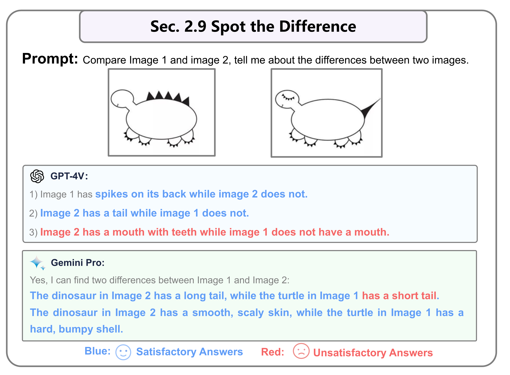


### 第3节：图像中的文本识别与理解
它集中在图像中的文本识别（包括OCR），如场景文本、数学公式和图表及表格文本识别等。同样，在这里不进行文本内容的进一步推断。属于第一层最为基本的任务。一共有9个小节。

### 3.1 场景文字识别
这里是从股市交易板，室外店铺招牌等场景中去提取文字以及数字信息。这两个模型都展现出在许多复杂情境下识别场景文本的熟练能力。


### 3.2 数学公式识别
这里是将图片中的公式转化为Latex格式，我们发现无论是GPT-4V还是Gemini在数学公式识别方面均较为欠缺。当公式变复杂时，都无法准确读出公式。
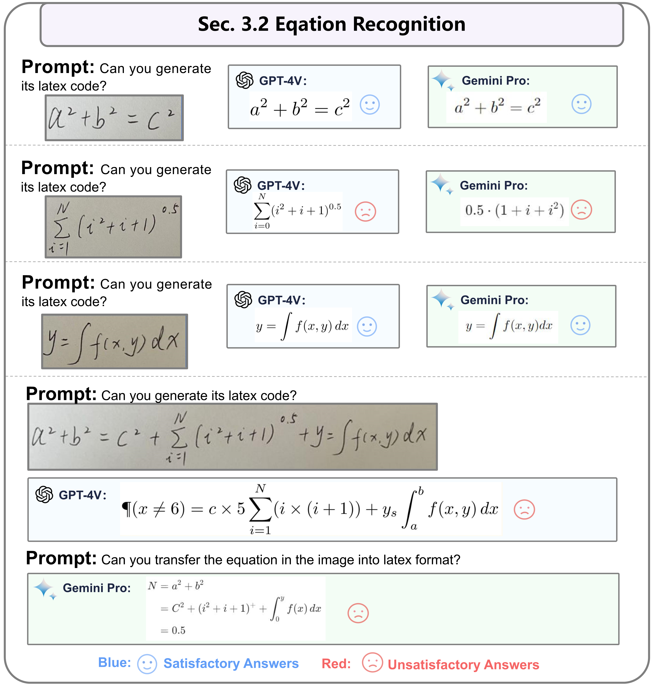

### 3.3 图表信息识别
这里展示的是针对表格图片的文字识别和提取。整体来说，这里GPT-4V的能力不如Gemini Pro。


### 第4节：图像推理能力
超越基本图像识别，这一部分涉及更高级的推理。这包括理解幽默和科学概念，以及像侦探工作、图像组合、智力测试中寻找模式以及情感理解和表达等逻辑推理能力。这里属于第二个层次即除了基本识别需要进行进一步的推理。一共有6个小节。

### 4.1 幽默信息理解（梗图）
在幽默图片理解方面。GPT-4V和Gemini都展现出了令人满意的能力，可以理解嵌入在Memes中的幽默。


### 4.2 科学常识理解
GPT-4V和Gemini都能够以理解科学的常识，并收集必要的信息来回答问题。在第一个例子中，Gemini的描述中存在遗漏。


### 4.3 侦探识别
这里的任务是给定一个房屋的图片，去推理屋子主人的性格。GPT-4V和Gemini都能够根据常识很好地推断图像。
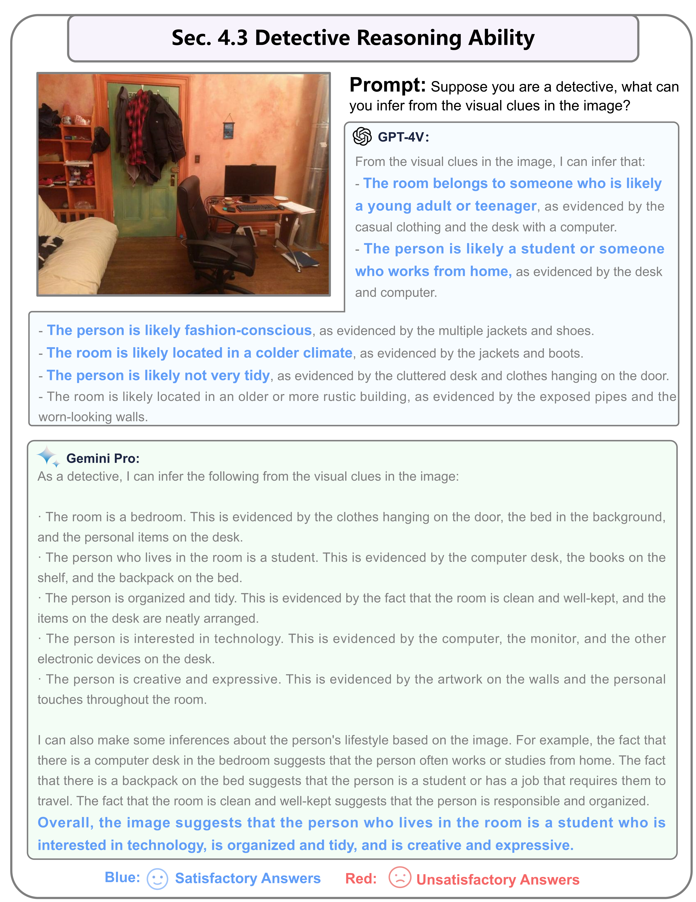

### 4.4 图片组合能力
这里是一个人用袋子装扮自己的头和身子。GPT-4V和Gemini都知道如何以合理的方式组合这三个部分。当然，在这里GPT-4V提供了一个更令人满意的答案，给出了三张子图片组合成一张图片的顺序。
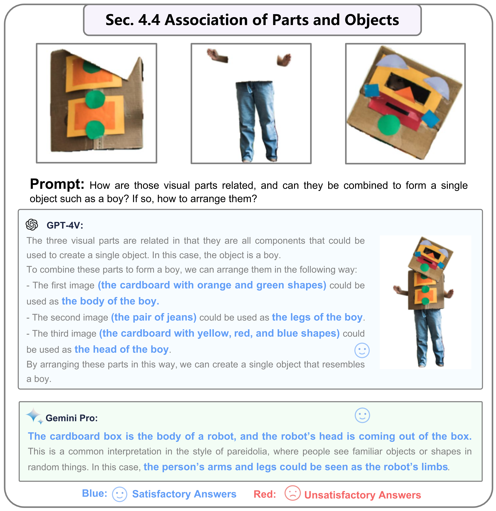

### 4.5 IQ测试（公务员考试：找规律）
对于Wechsler成人智力量表（WAIS）中的找规律问题，Gemini表现不佳。这表明它在识别和比较多个图像方面的能力可能有限。
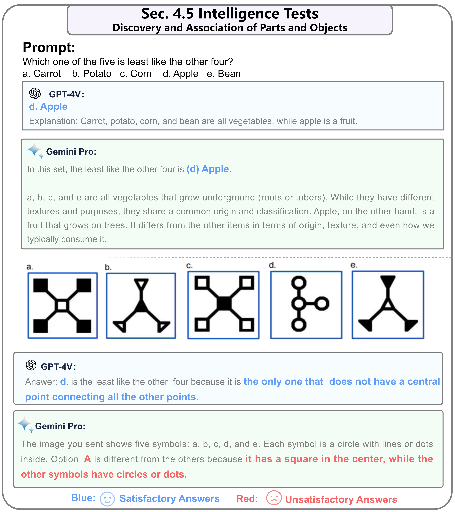

### 4.6 EQ测试（情绪理解和输出）
在对于图片所表达的情感上。GPT-4V和Gemini都理解不同的视觉内容如何引发人类情感。


### 第5节：图像中的文本推理
超越基本图像识别，这一部分涉及更高级的推理。这包括理解幽默和科学概念，以及像侦探工作、图像组合、智力测试中寻找模式以及情感理解和表达等逻辑推理能力。这里属于第二个层次即除了基本识别需要进行进一步的推理。一共有3个小节。

### 5.1 解决数学题目
针对简单的数学问题，GPT-4V和Gemini都能够给出准确的回答。
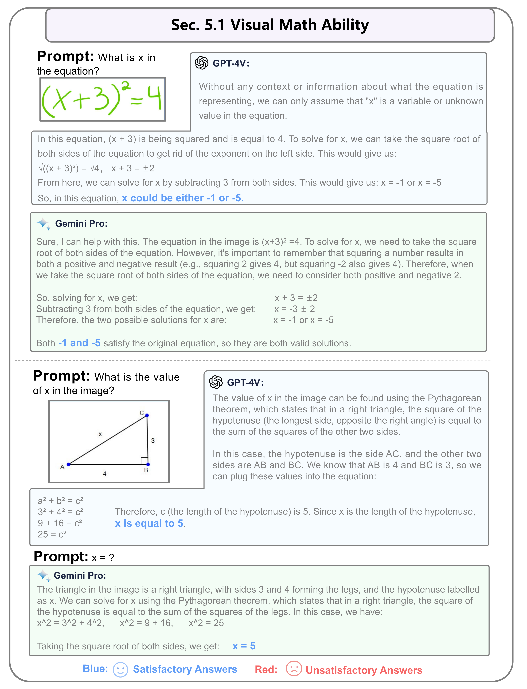

### 5.2 图标理解
这里我们展示的是针对流程图的理解。这个例子中两个模型都能够将流程图转化为Python代码。
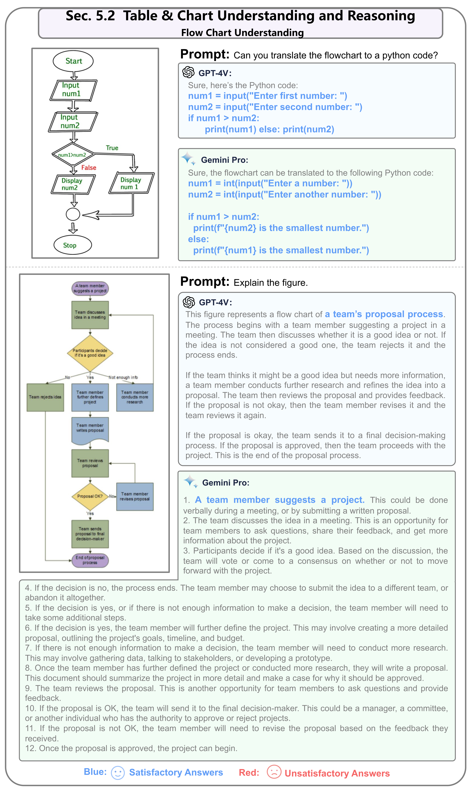

### 5.3 文档理解
这里展示的是一个公寓房屋的平面设计图。这里两个模型都给出了准确的回答。但是Gemini的回答更加的完整，有条理。


### 第6节：图像和文本的综合理解
超越基本图像识别，这一部分涉及更高级的推理。这包括理解幽默和科学概念，以及像侦探工作、图像组合、智力测试中寻找模式以及情感理解和表达等逻辑推理能力。这里属于第三个层次针对图文的综合性理解。一共有2个小节。

### 6.1 交错的图像文本输入
这个图像涉及输入多张账单并计算其中的税款。GPT-4V可以准确提供输出，而Gemini对于连接在一起的图像的回答不令人满意。然而，它在为每张图像提供个别答案方面表现良好。


### 6.2 针对图像生成的识别的评分
通过自我反思来改进文本到图像模型SDXL的生成文本提示，GPT-4V反映出了初始提示中没有提及狗的品种的错误，并做出了正确的修订。而Gemini生成的文本提示更好，提到了狗的品种。


### 第7节：物体定位
强调对象定位能力，要求模型提供指定对象的相对坐标（左上角和右下角的坐标）。这包括关注室外物体，如停车场中的汽车和抽象图像定位。一共有2个小节。

### 7.1 现实世界中的物体定位
这里是针对识别出停车场中的一个汽车。在这之前我们给出了一个啤酒瓶定位的例子。GPT-4V和Gemini都能够理解坐标以生成视觉指示输出。


### 7.2 抽象图像定位
这里是针对指出抽象物体七巧板中的一个部分的位置。通过提示它们输出定位框的角点，GPT-4V可以定位到抽象鹅的头部，而Gemini在这种情况下未能成功。
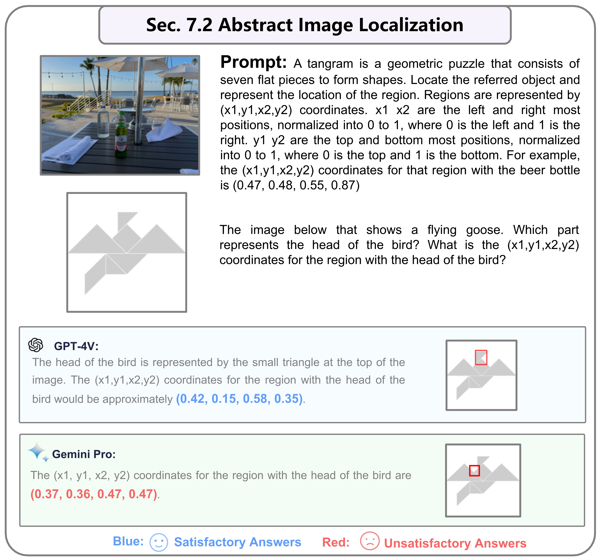


### 第8节：时间视频理解
通过关键帧评估模型对时间性的理解。这一部分包括两项任务：一项涉及对视频序列的理解，另一项关注关键帧的排序。一共有2个小节。

### 8.1 时序动作识别
在给定一系列连续动作的情况下，GPT-4V和Gemini都能够生成正确的理解。
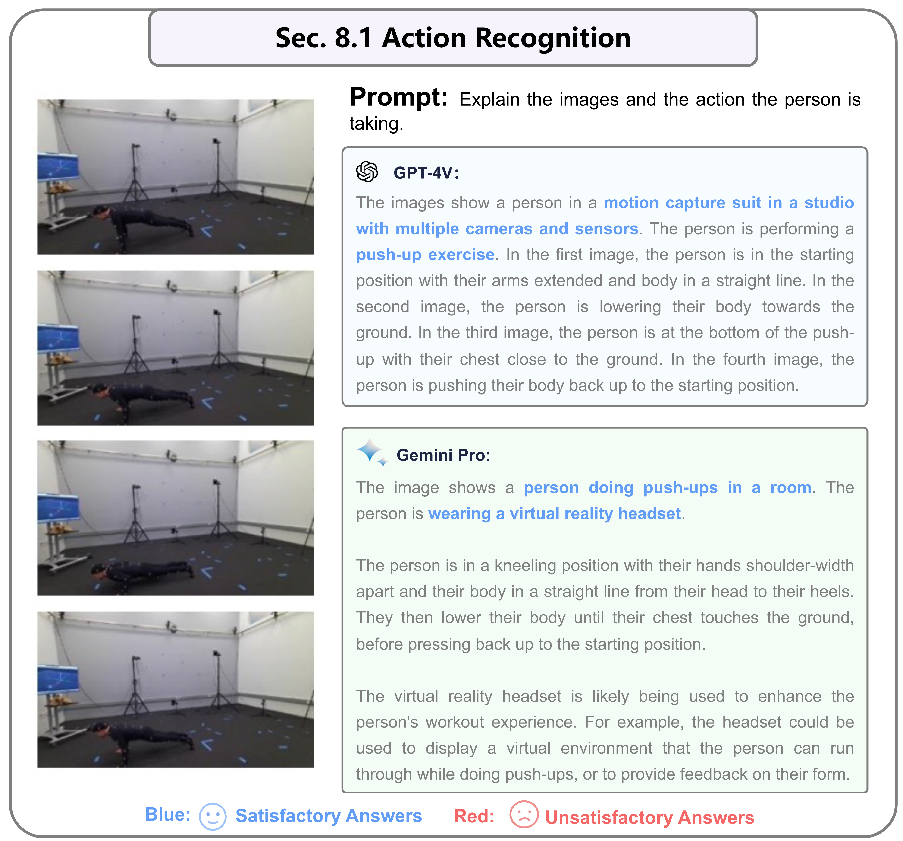

### 8.2 关键帧排序
寿司制作过程是无序的，只有GPT4-V能够找到正确的顺序，而Gemini在这种情况下失败了。


### 第9节：多语言能力
它全面评估在识别、理解和生成多种语言内容方面的能力。这包括在图像中识别非英语内容和以其他语言表达信息的能力。一共有2个小节。

### 9.1 图片多语言理解输出
GPT-4V和Gemini都能够用不同的语言描述图像。


### 9.2 多语言场景文字理解
GPT-4V和Gemini都可以识别这三张图片中的场景文本。


### 第10节：应用
展示了多模态大型模型的各种应用场景。我们旨在向行业展示更多可能性，提供创新的思路。可以根据特定领域的需求定制多模态大型模型。在这里，我们展示了七个子领域。

### 10.1 应用：缺陷检测
这里是进行工业流水线上进行缺陷检测。这两个模型都能够相当准确地检测图像中物体的缺陷。然而，值得注意的是，在这类任务中，Gemini提供了更多的细节。
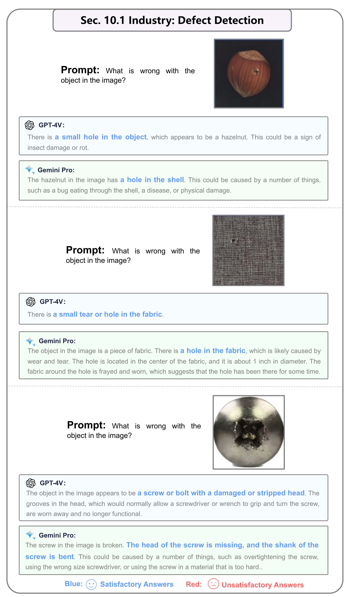

### 10.2 应用：杂货结账
这里是超市自助收银的应用。虽然GPT-4V提供了更全面和详细的结果，但也存在一些错误。另一方面，Gemini只识别了四个对象，但是识别是正确的，甚至为每个项目都包括了相应的图像。这表明，虽然GPT-4V在发现方面提供了广度，但Gemini提供了准确性，在执行这类任务时展示了不同的优势。


### 10.3 应用：汽车保险
这里是进行车祸现场的损伤程度判断。两者都展示了他们执行全面、详细和准确的损伤评估的能力。


### 10.4 应用：定制字幕生成器
这里是首先将单个物体的图片和名称输入给模型作为prompt，之后再输入一个完整的场景让模型去描述其中各个物体的相对位置。GPT-4V提供了更全面、准确和有条理的描述，而Gemini则表现不佳，未能识别左图中蜗牛壳的存在，并错误地描述了蜗牛的位置。这表明，虽然GPT-4V在提供详细和精确的描述方面表现出色。


### 10.5 应用：评估图像生成
针对图像生成文字prompt和生成图片的匹配度测试。这两个模型都准确描述了图像内容并提供了相应的解释和一致的分数。值得注意的是，Gemini为其评估提供了更详细的理由。
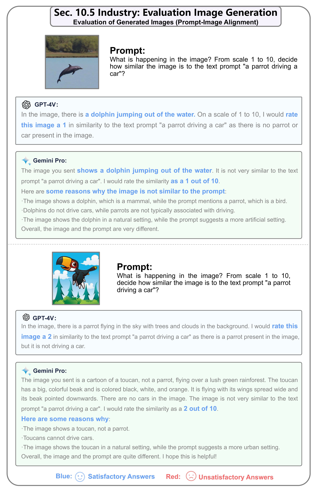

### 10.6 应用：具身智能代理
再Embodied AI的应用上。GPT-4V提供了正确的回答，并附带清晰而简洁的解释。相比之下，Gemini提供的回答完全不正确。
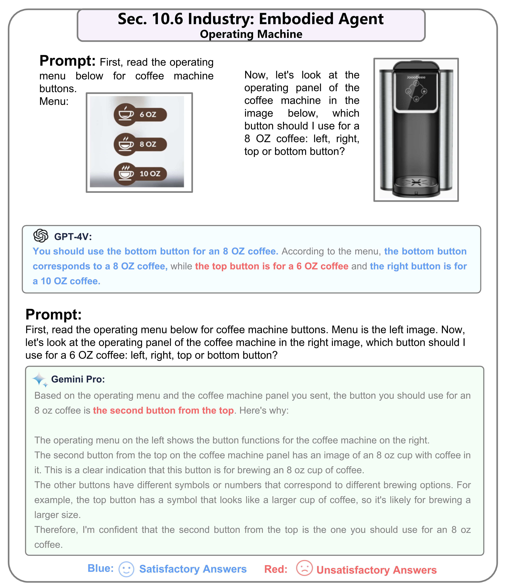

### 10.7 应用：GUI导航
在这个例子中，我们给的是使用PC网络搜索引擎去搜索麻婆豆腐的菜谱。这里是从刚开机的电脑界面一步步利用多模态模型进行引导。这里我们仅仅给出了第一步。
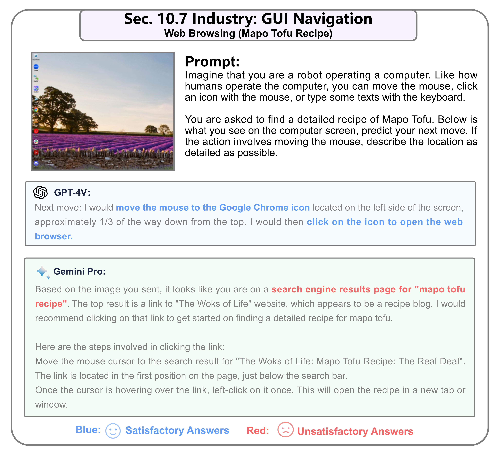


### 第11节：将GPT-4V和Gemini进行结合
在本节中，我们探索如何将GPT-4V和Gemini进行结合，利用他们各自的优势，一共有2个小节。

### 11.1 产品识别和推荐
我们首先使用GPT-4V来描述图片中的所有物体，然后将GPT-4V的答案作为输入的一部分，使用Gemini来推荐类似产品的链接。


### 11.2 多图像识别和故事生成
我们首先使用GPT-4V来描述图片中包含的所有场景，然后使用Gemini生成一个特定风格的长篇故事。


## 📝 Conclusions
我们已经对GPT-4V和Gemini的多模态理解和推理能力进行了全面的比较，涵盖了多个方面，并得出了以下结论：

$\color{darkgreen}{图像识别与理解。}$ 在基本图像识别任务中，两个模型表现出了可比较的性能，并能够有效地完成任务。
$\color{darkgreen}{图像中的文本识别与理解。}$ 两个模型都擅长从图像中提取和识别文本。然而，在复杂的公式和仪表盘识别方面还需要改进。Gemini在读取表格信息方面表现更好。
$\color{darkgreen}{图像推理能力。}$ 在图像推理方面，两个模型都在常识理解方面表现出色。与GPT-4V相比，Gemini在寻找模式方面稍显不足（智力测试）。在情感理解测试中，两者都能理解情感并具有审美判断能力。
$\color{darkgreen}{图像中的文本推理。}$ 在文本推理领域，当处理复杂的基于表格的推理和数学问题解决任务时，Gemini表现出相对较低的性能水平。此外，Gemini倾向于提供更详细的输出。
$\color{darkgreen}{综合图像和文本理解。}$ 在涉及复杂文本和图像的任务中，由于Gemini无法一次输入多个图像，它在某些方面落后于GPT-4V，尽管在处理单一图像的文本推理方面与GPT-4V表现相似。
$\color{darkgreen}{对象定位。}$ 两个模型在现实世界的对象定位方面表现相似，Gemini在抽象图像（七巧板）的定位方面略逊一筹。
$\color{darkgreen}{时间视频理解。}$ 在理解时间性方面，Gemini的单一图像输入模式在某些方面不及GPT-4V，特别是在理解序列方面。
$\color{darkgreen}{多语言能力。}$ 两个模型都展现出良好的多语言识别、理解和输出能力，能够有效完成多语言任务。
在工业应用方面，Gemini在具体智能代理和GUI导航方面不如GPT-4V，这也归因于Gemini的单一图像、非记忆输入模式。结合这两个大型模型可以发挥它们各自的优势。总的来说，Gemini和GPT-4V都是强大而令人印象深刻的多模态大型模型。就整体性能而言，GPT-4V略优于Gemini Pro。这与Gemini报告的结果一致。我们期待Gemini Ultra和GPT-4.5的发布，它们有望为视觉多模态应用领域带来更多可能性。


## 🔗 Citation

如果您觉得有用，请引用:

```bibtex
@misc{qi2023gemini,
      title={Gemini vs GPT-4V: A Preliminary Comparison and Combination of Vision-Language Models Through Qualitative Cases}, 
      author={Zhangyang Qi and Ye Fang and Mengchen Zhang and Zeyi Sun and Tong Wu and Ziwei Liu and Dahua Lin and Jiaqi Wang and Hengshuang Zhao},
      year={2023},
      eprint={2312.15011},
      archivePrefix={arXiv},
      primaryClass={cs.CV}
}

```

