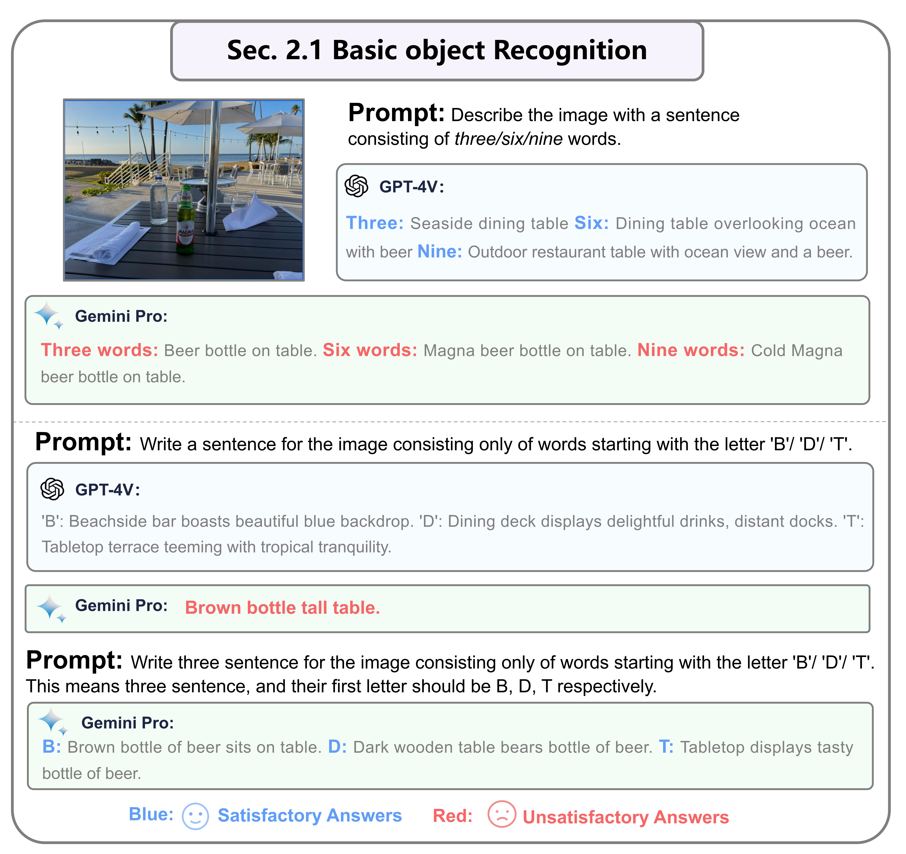
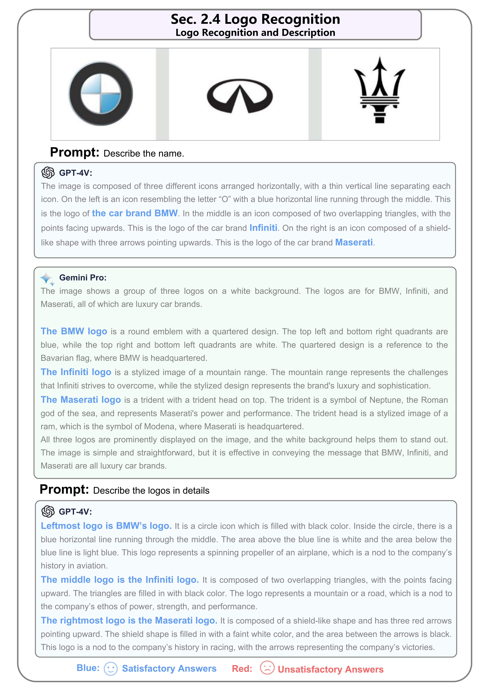
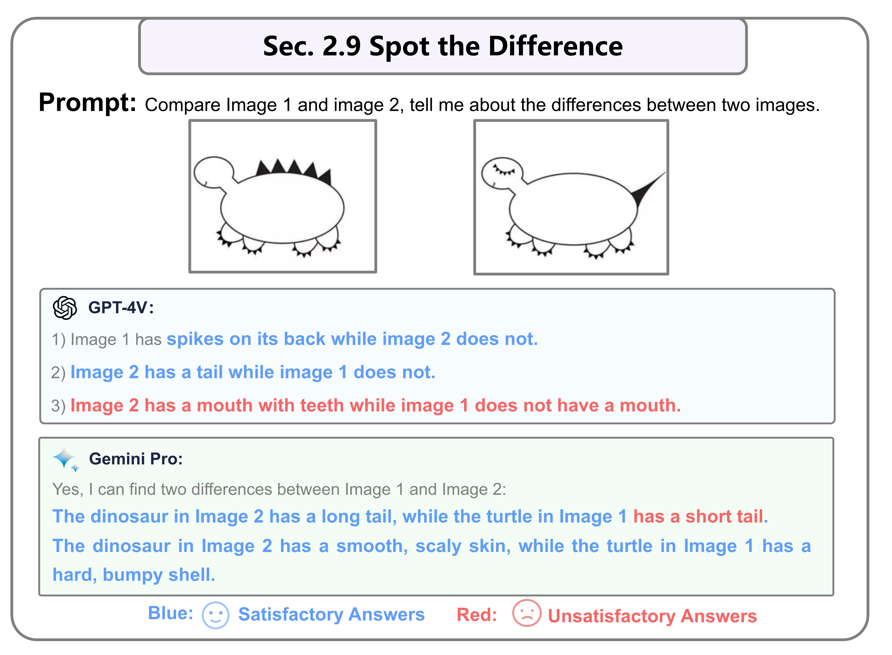
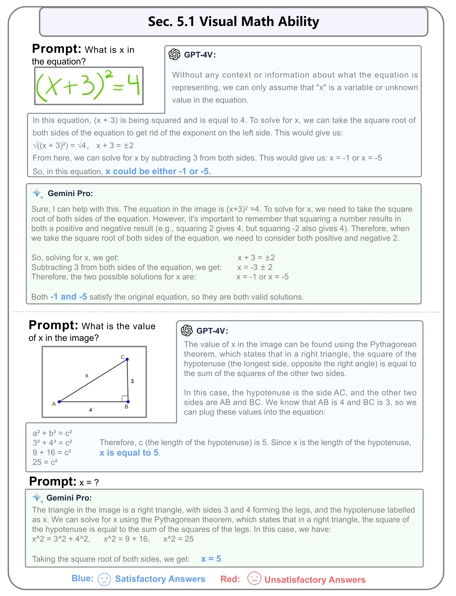
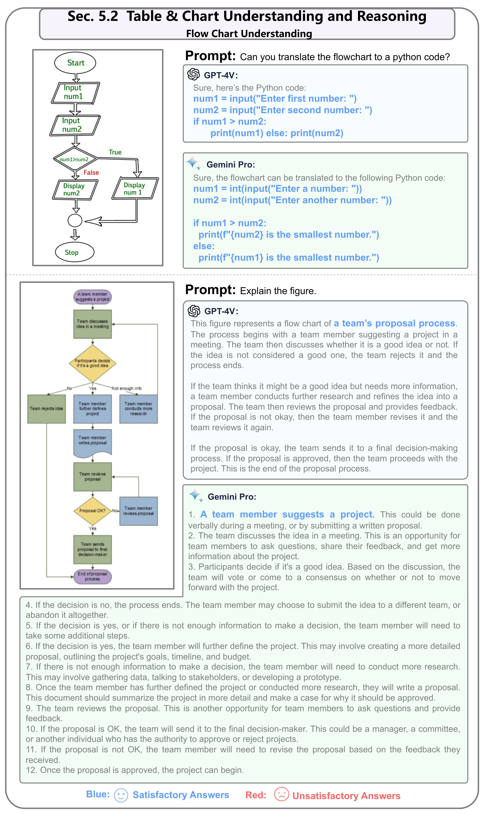
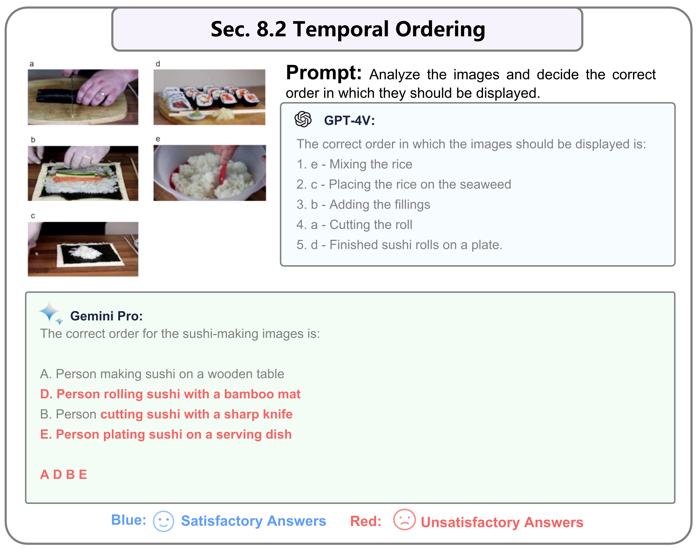
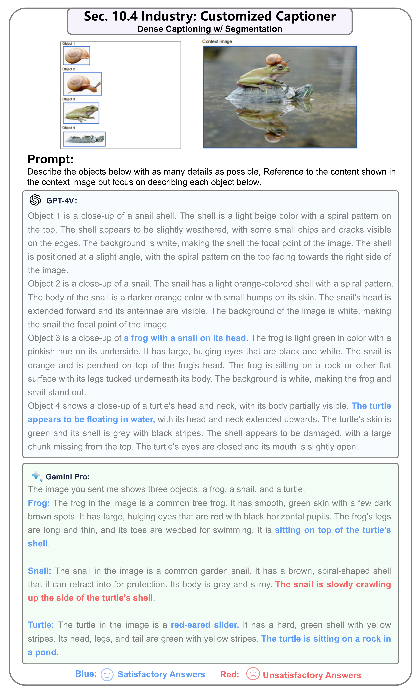
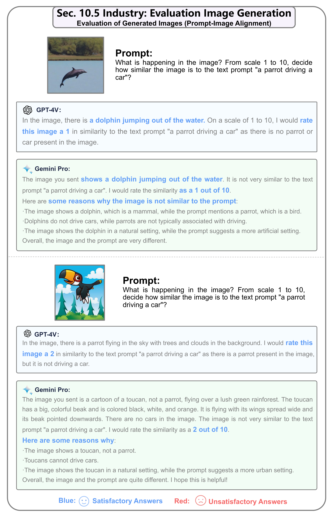
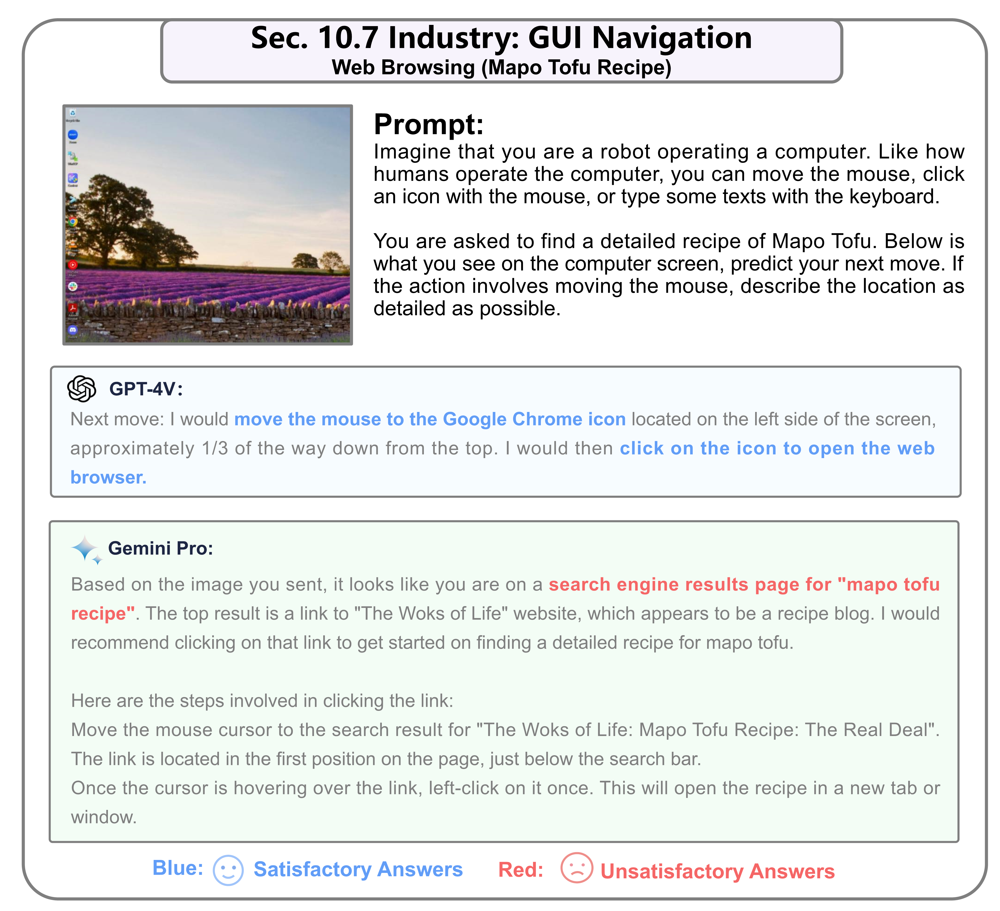

# Gemini vs GPT-4V: A Preliminary Comparison and Combination of Vision-Language Models Through Qualitative Cases

## 🤖 Demos
### Section 2: Image Recognition and Understanding
This section focuses on basic recognition and understanding of image content, excluding further inference. It covers tasks such as landmark, food, logo, abstract image recognition, autonomous driving scene understanding, fake information detection, difference spotting, and object counting. These are fundamental tasks of the first layer. The section comprises 9 subsections.

### 2.1 Basic Object Recognition
Testing the models' basic object recognition and description capabilities. GPT-4V and Gemini both accurately recognize basic objects and provide textual descriptions without significant differences.

### 2.2 Landmark Recognition
Both models excel in accurately recognizing landmarks, but GPT-4V generates concise descriptions, while Gemini tends to provide more detailed narratives for tourist attractions, even indoors, including other pictures of the sites and related information links.

### 2.3 Food Recognition
Both models demonstrate the ability to recognize a wide variety of dishes, enhancing their recognition of details such as ingredients, decorations, and cooking techniques in food images. The conclusion is similar to that of landmark recognition.

### 2.4 Logo Recognition
Both models successfully recognize logos and provide comprehensive descriptions, capturing information on design, color, shape, and symbolic representation.

### 2.5 Abstract Image Recognition
While GPT-4V provides reasonable answers, Gemini's responses seem less logical in recognizing abstract images like Tangram puzzles, possibly due to being trained on all stitched images.

### 2.6 Scene Understanding (Autonomous Driving)
Both models are adept at providing detailed descriptions of autonomous driving scenes and objects. In the first example, Gemini's description shows a minor error.

### 2.7 Counterfactual Examples (Fabricated Objects)
This involves providing a factual description related to the scenes and objects presented in the image, even when the textual prompt asks the model to find non-existent objects in the picture. Both models manage this well.

### 2.8 Object Counting
The task is to count the number of fruits in a picture. Both models need improvement in counting. Compared to GPT-4V, Gemini's counting ability is relatively weaker, likely due to its weaker multimodal memory performance, preventing it from being guided to the correct answer.

### 2.9 Spot the Differences
This tests the models' ability to spot differences between two pictures. Both GPT-4V and Gemini have limitations in this area, with GPT-4V being somewhat more accurate.

### Section 3: Text Recognition and Understanding in Images
Focusing on text recognition within images (including OCR) such as scene text, mathematical equations, and text in charts and tables, this section avoids further inference of the text content. It's part of the first basic layer of tasks and includes 9 subsections.

### 3.1 Scene Text Recognition
Extracting text and numbers from scenes like stock market boards and outdoor shop signs. Both models show proficiency in recognizing scene text in many complex situations.

### 3.2 Equation Recognition
Converting equations in images to LaTeX format, both GPT-4V and Gemini struggle with equation recognition, especially when the formulas become complex.

### 3.3 Chart Text Recognition
Demonstrating text recognition and extraction from table images. Overall, GPT-4V's abilities lag behind those of Gemini Pro in this task.

### Section 4: Image Inference Abilities
Beyond basic image recognition, this part involves higher-level reasoning, including understanding humor and scientific concepts, detective work, image combination, pattern finding in intelligence tests, and emotional understanding and expression. This is the second level of tasks requiring further inference beyond basic recognition. There are 6 subsections.
### 4.1 Humorous Image Understanding, Memes
In understanding humor in images, both GPT-4V and Gemini demonstrate satisfactory abilities, comprehending the humor embedded in Memes.

### 4.2 Multimodal Knowledge and Commonsense
Both GPT-4V and Gemini can understand scientific common sense and gather necessary information to answer questions. In the first example, there's a missing detail in Gemini's description.

### 4.3 Detective Reasoning Ability
Given an image of a house, the task is to infer the homeowner's personality. Both GPT-4V and Gemini make good inferences based on common sense.

### 4.4 Association of Parts and Objects
This involves combining three parts of a person dressed in a bag over their head and body. Both GPT-4V and Gemini know how to combine these parts logically. GPT-4V provided a more satisfying answer, giving the order of the sub-images to form one image.

### 4.5 Intelligence Tests
For pattern finding problems in the Wechsler Adult Intelligence Scale (WAIS), Gemini performs poorly, indicating limited ability in recognizing and comparing multiple images.

### 4.6 Emotional Intelligence Tests (Emotional Understanding and Output)
In understanding the emotions expressed in pictures, both GPT-4V and Gemini grasp how different visual content can evoke human emotions.
Emotional Intelligence Tests

### Section 5: Text Inference in Images
Beyond basic image recognition, this part involves higher-level reasoning. It includes understanding humor and scientific concepts, detective work, image combination, intelligence test pattern finding, and emotional understanding and expression. This is the second level of tasks requiring further inference beyond basic recognition. There are 3 subsections.

### 5.1 Visual Math Ability
For simple math problems, both GPT-4V and Gemini can provide accurate answers.

### 5.2 Table & Chart Understanding and Reasoning
Here, the models demonstrate their understanding of flowcharts. In this example, both models can convert flowcharts into Python code.

### 5.3 Document Understanding And Reasoning
Shown here is an apartment floor plan. Both models provide accurate answers, with Gemini's response being more complete and organized.

### Section 6: Integrated Understanding of Images and Text
Beyond basic image recognition, this part involves higher-level reasoning, including understanding humor and scientific concepts, detective work, image combination, intelligence test pattern finding, and emotional understanding and expression. This is the third level focusing on integrated understanding of text and images. There are 2 subsections.
### 6.1 Interleaved Image-Text Inputs
The image involves calculating taxes from multiple bills. GPT-4V can accurately provide outputs, while Gemini struggles with responses to connected images but performs well in providing individual answers for each image.

### 6.2 Text to Image Generation Guidance
Improving text-to-image model SDXL prompts through self-reflection, GPT-4V acknowledges the error in the initial prompt not mentioning the dog's breed and makes a correct revision. Gemini's generated text prompt is better, mentioning the dog's breed.

### Section 7: Object Localization
Emphasizing object localization abilities, models are required to provide relative coordinates (top-left and bottom-right corners) of specified objects. This includes focusing on outdoor objects, like cars in parking lots, and abstract image localization. There are 2 subsections.

### 7.1 ObjectVLocalization in Real World
Targeting the identification of a car in a parking lot, following an example of locating a beer bottle. Both GPT-4V and Gemini understand coordinates to generate visual indication outputs.

### 7.2 Abstract Image Localization
Targeting the location of a part of an abstract object, the Tangram. By prompting them to output the corners of the location box, GPT-4V can localize the head of the abstract goose, while Gemini fails in this scenario.

### Section 8: Temporal Video Understanding
Assessing the models' understanding of temporality through keyframe evaluation, this part includes two tasks: understanding video sequences and focusing on keyframe ordering. There are 2 subsections.

### 8.1 Action Recognition
Given a series of continuous actions, both GPT-4V and Gemini can generate correct understandings.

### 8.2 Temporal_Ordering
The sushi-making process is unordered, only GPT-4V finds the correct order, while Gemini fails in this scenario.

### Section 9: Multilingual Capabilities
A comprehensive assessment of the ability to recognize, understand, and generate content in multiple languages. This includes recognizing non-English content in images and expressing information in other languages. There are 2 subsections.

### 9.1 Multilingual Image Description
Both GPT-4V and Gemini can describe images in different languages.

### 9.2 Multilingual Scene Text Recognition
Both GPT-4V and Gemini can recognize the scene text in these three images.

### Section 10: Industry
Demonstrating various application scenarios of large-scale multimodal models, this section aims to showcase more possibilities to the industry and provide innovative ideas. Multimodal large models can be customized according to specific field requirements. Here, we present seven sub-fields.

### 10.1 Industry: Defect Detection
Performing defect detection on industrial assembly lines. Both models can detect defects in objects within images quite accurately. However, it's worth noting that Gemini provides more details in such tasks.

### 10.2 Industry: Grocery Checkout
Self-checkout applications in supermarkets. While GPT-4V provides more comprehensive and detailed results, some errors exist. On the other hand, Gemini identifies only four objects correctly, even including corresponding images for each item. This shows that while GPT-4V offers breadth in discovery, Gemini offers accuracy, displaying different strengths in performing such tasks.

### 10.3 Industry: Auto Insurance
Judging the extent of damage at a car accident scene. Both demonstrate their ability to conduct comprehensive, detailed, and accurate damage assessments.

### 10.4 Industry: Customized Captioner
First inputting individual object pictures and names as prompts to the model, then inputting a complete scene for the model to describe the relative positions of various objects. GPT-4V provides more comprehensive, accurate, and organized descriptions, while Gemini performs poorly, failing to recognize the existence of a snail shell in the left image and incorrectly describing the snail's position. This shows GPT-4V's excellence in providing detailed and precise descriptions.

### 10.5 Industry: Evaluation Image Generation
Testing the match between text prompts and generated images. Both models accurately describe the image content and provide corresponding explanations and consistent scores. Notably, Gemini provides more detailed reasons for its evaluations.

### 10.6 Industry: Embodied Agent
In Embodied AI applications, GPT-4V provides the correct answer with a clear and concise explanation. In contrast, Gemini's response is entirely incorrect.

### 10.7 Industry: GUI Navigation
Here, the example is using a PC web search engine to search for a Mapo tofu recipe, starting from a freshly booted computer interface, guided step by step through a multimodal model. Only the first step is presented here.

### Section 11: Integrating GPT-4V and Gemini
In this section, we explore how to combine GPT-4V and Gemini, leveraging their respective strengths, with two subsections.

### 11.1 Product Identification and Recommendation
First, we use GPT-4V to describe all objects in a picture. Then, the answer from GPT-4V is used as part of the input for Gemini to recommend links for similar products.

### 11.2 Multi-Image Recognition and Story Generation
Initially, GPT-4V is employed to describe all the scenes contained in a picture. Following this, Gemini is used to generate a long narrative in a specific style based on these descriptions.

